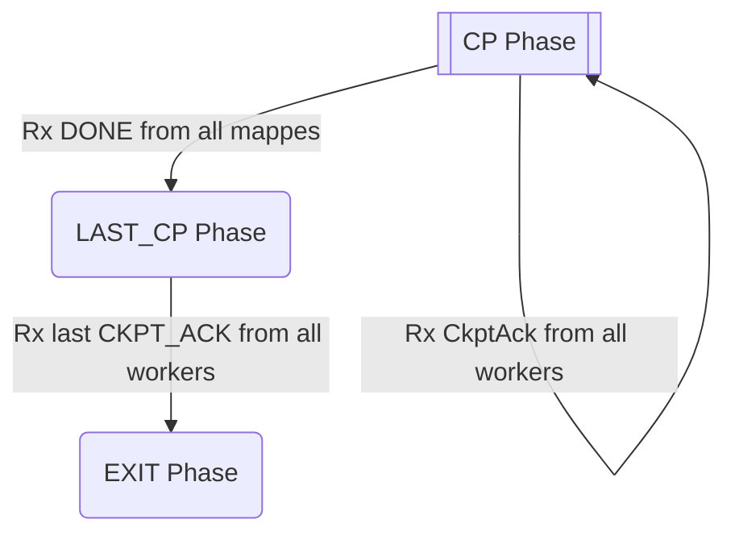
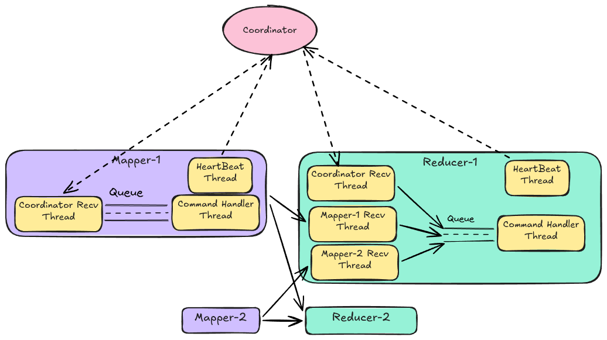

## How to run
1. Complete the setup in the [repo-root README](../README.md#prerequisites) (Redis, Python, venv, requirements, and `python generator.py` to populate the shared `csv_files/` dataset).
2. `python main.py` to run the system.
3. `python checker.py` to verify the produced checkpoints are consistent.

## Coordinator's State Machine

## Worker's Internals

