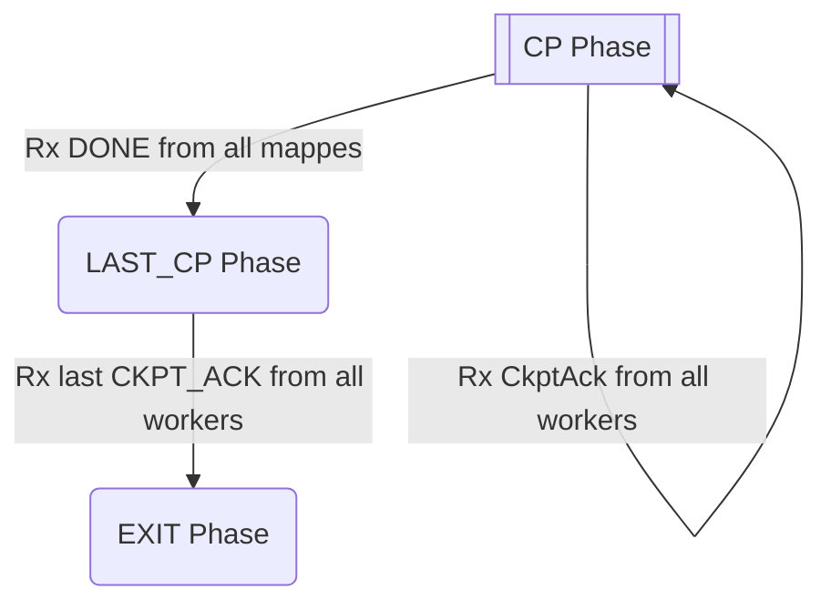

## How to run
1. Complete the setup in the [repo-root README](../README.md#prerequisites) (Redis, Python, venv, requirements).
2. `python main.py {none | test_reducer | test_mapper | test_both | test_all}` to run the system.
   - `none` — no crashes.
   - `test_reducer` / `test_mapper` — periodically crash a random reducer / mapper.
   - `test_both` — periodically crash both a random reducer and a random mapper.
   - `test_all` — periodically crash every mapper and reducer.
3. `python checker.py` to verify the produced checkpoints are consistent.

## Coordinator's State Machine

